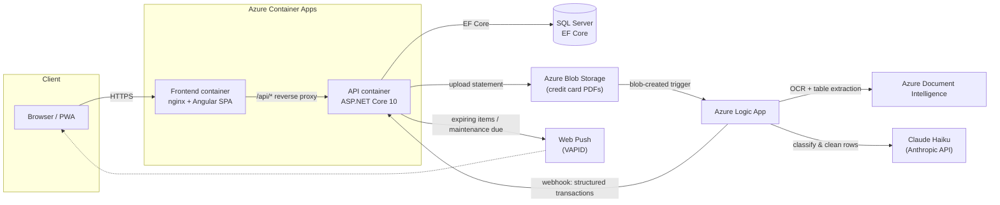

# Personal Assistant

A full-stack personal management platform — budget, credit cards, loans, vehicles, books, groceries, pantry, and goals — built as a long-running personal project and now serving as a portfolio piece.

**Live demo:** https://budget-frontend.bluesmoke-64ab0244.centralus.azurecontainerapps.io

> Demo credentials: `demo@demo.com` / `PersonalAssistant123` — a dedicated test account, seeded separately from my own data. (This is my live, actual-use instance, so public self-registration is intentionally not advertised here.)

---

## Table of contents

- [About](#about)
- [Architecture](#architecture)
- [Tech stack](#tech-stack)
- [Modules](#modules)
- [Technical highlights](#technical-highlights)
- [Project structure](#project-structure)
- [Running it locally](#running-it-locally)
- [Testing](#testing)
- [Deployment](#deployment)
- [Design notes / trade-offs](#design-notes--trade-offs)

---

## About

This started in mid-2026 as a weekend project to replace a spreadsheet I used to track my own budget. Over a few months it grew, module by module, into something closer to a personal ERP: whatever recurring bookkeeping task I was doing by hand — tracking loan payoffs, logging vehicle mileage, remembering which supermarket had the cheapest olive oil — became a module. Each one was scoped, built, and shipped as an independent unit of work (see `work-plans/` for the incremental plan documents), which is why the codebase reads as a set of consistent, repeatable patterns rather than one big monolithic build.

It's a solo project, but it's built the way I'd build something for a team: typed end-to-end (C# + TypeScript), tested where it matters, documented for the next person (or the next me, six months later) to pick up quickly.

## Architecture



Two containers, one database, and one asynchronous document pipeline. The frontend never talks to the API cross-origin — nginx proxies `/api/*` to the API container so the browser only ever sees a single origin, which sidesteps CORS and lets the JWT live in `localStorage` without extra cookie/SameSite complexity.

## Tech stack

| Layer | Technology | Why |
|---|---|---|
| Backend | ASP.NET Core 10 Web API, C# | Strong typing end-to-end, first-class EF Core + Identity integration, minimal ceremony for a REST API this size |
| ORM / DB | Entity Framework Core → SQL Server (LocalDB locally, Azure SQL/containerized SQL Server in deployment) | The domain is heavily relational (transactions → categories → budgets → users) — a document store would just be reinventing joins in application code |
| Auth | ASP.NET Core Identity + self-issued JWT | Full control over the token contents and lifetime, no external IdP dependency for what's fundamentally a single first-party SPA client |
| Frontend | Angular 21, standalone components (no NgModules) | Modern Angular's DI graph is simpler without NgModules; standalone + `loadComponent` gives per-route lazy loading out of the box |
| UI | Bootstrap 5, Iconify (Tabler icons), ApexCharts | Fast to build with, no heavyweight component library lock-in |
| PWA | Angular Service Worker, Web Push (VAPID) | This is a daily-use app on my phone — needed offline resilience and home-screen installability, not just a desktop dashboard |
| Containers | Docker, docker-compose (local), Azure Container Apps (prod) | Reproducible builds locally and in the cloud; Container Apps over App Service for cheaper scale-to-zero-friendly hosting once the AI pipeline made "always-on App Service" wasteful |
| Document AI | Azure Blob Storage → Azure Logic Apps → Azure Document Intelligence → Claude Haiku (Anthropic API) | See [Technical highlights](#technical-highlights) — this is the one part of the app that isn't "just CRUD" |
| Testing | xUnit + FluentAssertions (backend, in-memory DB), Karma/Jasmine (frontend) | Integration tests hit real controller/EF Core wiring against `InMemoryDatabase`, not mocks — catches wiring bugs mocks would hide |

## Modules

Each module below is a vertical slice: EF Core entity → `[Authorize]`-protected REST controller → Angular feature view, all filtered per-user by a JWT claim. Sixteen feature views, 21 API controllers, 32 entities, 29 EF Core migrations as of this writing.

| Module | What it does |
|---|---|
| 💰 **Budget & Transactions** | Income/expense/investment ledger, filtered by a configurable *billing period* (e.g. "the 5th of one month to the 4th of the next") rather than the calendar month, since that's how paychecks and credit card statements actually cycle. Recurring transaction templates auto-generate monthly. CSV import/export. |
| 🎯 **Category limits** | A year-at-a-glance editable grid of per-category monthly spending targets, with progress bars against actuals — for both cash transactions and credit card spend. |
| 🏦 **Accounts** | Balances across regular and investment accounts, with daily history snapshots powering trend charts. |
| 🎁 **Goals** | Savings goals with a target amount/date; the UI computes the monthly contribution still needed to hit the deadline. |
| 🏠 **Loans** | Amortization tracking with a real payment ledger (principal/interest/insurance split per payment), plus optional payoff-acceleration goals ("pay this off by X, here's the extra you'd need per month"). |
| 📚 **Books** | Reading tracker with daily page-progress history and a pace prediction based on the last 7 days. Technical books get an extra "lab task" checklist (for working through exercises alongside the reading). |
| 🚗 **Vehicles** | Mileage, fuel, and maintenance logs per vehicle, with auto-generated reminders derived from each maintenance entry's "next due" date/mileage. |
| 🛒 **Grocery & Pantry** | Shopping list with per-supermarket price history (many-to-many item↔supermarket), and a home inventory that tracks what's expiring soon. |
| 💳 **Credit cards** | Statement PDFs are parsed automatically instead of typed in by hand — see below. |
| 🔔 **Notifications** | Web Push alerts for expiring pantry items and upcoming vehicle maintenance, deduplicated so you're not pinged twice for the same thing. |
| 📊 **Dashboard** | Cross-module summary: income/expense/net balance, spending by category, budget-vs-actual, goal progress, a 6-month trend chart. |

## Technical highlights

**AI-assisted credit card statement import.** The tedious part of budgeting is always data entry, and credit card statements are the worst offender — dozens of line items a month, every month. Instead of typing them in, you upload the statement PDF; a blob-storage trigger kicks off an Azure Logic App that runs the PDF through Azure Document Intelligence for OCR/table extraction, hands the extracted rows to Claude Haiku for cleanup and category classification, and calls back into the API with structured `CreditCardTransaction` rows ready for a quick human review pass. This is the one part of the system that isn't "just CRUD," and it's the reason the credit cards module exists as an async pipeline (`Pending` → processed statement) instead of a synchronous form.

**Billing-period logic, not calendar months.** A private `GetPeriod(cutoffDay, month, year)` helper (duplicated deliberately in `TransactionsController` and `DashboardController` rather than abstracted — small enough that a shared dependency wasn't worth the coupling) computes a period starting on a user-configurable cutoff day. Every dashboard stat, transaction filter, and recurring-transaction generation run is period-aware, not calendar-month-aware.

**Per-user data isolation without a multi-tenant framework.** Every entity carries a `UserId` FK to ASP.NET Identity's `AspNetUsers`, every controller declares `CurrentUserId => User.FindFirstValue(ClaimTypes.NameIdentifier)`, and every query filters by it. No row-level security magic — just a consistent, auditable convention applied to all 21 controllers, verified in integration tests via a `TestAuthHandler` that authenticates every test request as a fixed user id.

**PWA with a dynamic API URL.** Since this is used from a phone on different networks (home Wi-Fi vs. mobile data hitting a different LAN IP for local testing), the frontend can override its API base URL at runtime via `localStorage`, layered on top of the build-time environment config — so the same PWA install doesn't need a rebuild to point at a different backend.

**Deployment evolution.** This went from local IIS → Azure App Service + Static Web App → Docker containers on Azure Container Apps, each migration driven by a real constraint (IIS needed the dev machine on; App Service's always-on billing didn't make sense once the Logic App pipeline meant the API sat idle most of the time). The `work-plans/` folder has the write-up for each migration, including the actual debugging (SNI issues with the nginx reverse proxy, Kudu zipdeploy quirks) rather than a sanitized "it just worked" version.

## Project structure

```
backend/dotnet/
  personal-assistant-api/          ASP.NET Core Web API
    Controllers/                   One controller per entity + Dashboard/Auth
    Models/                        EF Core entities
    Data/                          DbContext
    Migrations/                    EF Core migration history
    Services/                      Blob storage, push notifications
  personal-assistant-api.Tests/    xUnit integration tests (WebApplicationFactory + InMemoryDatabase)

frontend/angular/personal-assistant-web/
  src/app/
    views/                         One folder per feature (standalone components, inline templates)
    core/services/api/             One HttpClient service per entity
    core/interceptors/             Auth (JWT) + dynamic API URL
    layouts/                       Shell, sidenav, topbar

work-plans/                        Incremental build log — one doc per feature/migration, written before the work started
```

## Running it locally

**Prerequisites:** .NET 10 SDK, Node 22+, SQL Server (or LocalDB on Windows), or just Docker.

**Fastest path — Docker Compose:**
```bash
docker compose up --build
# frontend: http://localhost:4200   api: http://localhost:5085
```

**Manual setup:**
```bash
# Backend
cd backend/dotnet/personal-assistant-api
dotnet ef database update
dotnet run                          # https://localhost:7146

# Frontend
cd frontend/angular/personal-assistant-web
npm install
ng serve                            # http://localhost:4200
```

Open `/login`, switch to the **Register** tab, and create an account — every entity is scoped per-user from the first request.

## Testing

```bash
# Backend — integration tests against a real controller pipeline, in-memory DB
dotnet test

# Frontend — Karma/Jasmine
ng test
```

Backend tests use a `WebApplicationFactory<Program>` with SQL Server swapped for `InMemoryDatabase` and JWT auth swapped for a fixed-identity `TestAuthHandler`, so they exercise real routing, model binding, and EF Core query filters instead of mocking them away.

## Deployment

Two Docker images (API, frontend+nginx) built with `az acr build` and deployed to Azure Container Apps — no local Docker daemon required for a deploy, just the Azure CLI. See `deploy-azure-containers.ps1`. The frontend's nginx config reverse-proxies `/api/*` to the API container over the Container Apps internal network, so the browser only ever talks to one origin.

## Design notes / trade-offs

A few deliberate choices worth calling out, since a portfolio README that only lists what went right isn't very useful:

- **No message queue for the credit card pipeline.** The Logic App → webhook flow is simple enough that a queue would be over-engineering for one user's statement volume. If this needed to scale past personal use, that's the first thing I'd swap in.
- **`GetPeriod` is duplicated, not shared.** Two call sites, ~15 lines, genuinely different enough contexts (dashboard aggregation vs. transaction filtering) that a shared abstraction would have added an indirection layer for no real benefit yet. Worth revisiting if a third call site shows up.
- **No row-level security / multi-tenancy framework.** Manual `UserId` filtering in every controller is more code than a framework would need, but it's explicit, greppable, and testable — I'd rather have 21 controllers doing the same obvious thing than one clever abstraction hiding how authorization actually works.
- **The database name (`BudgetApp`) doesn't match the product name.** The app was rebranded from "BudgetApp" to "Personal Assistant" as it outgrew being just a budget tracker (see `work-plans/WP_037.md`), but the live database wasn't renamed to avoid an unnecessary migration risk on data that already existed. Cosmetic, but flagged here so it doesn't look like an oversight.

---

Built by [Christopher Casso](https://github.com/ccassob).
